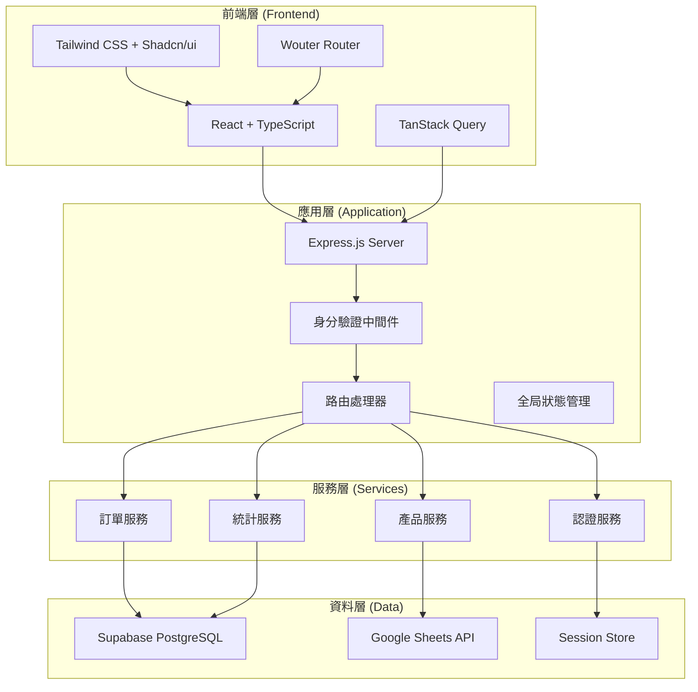
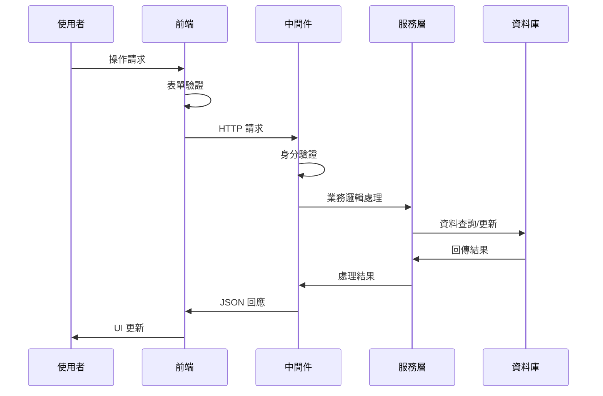
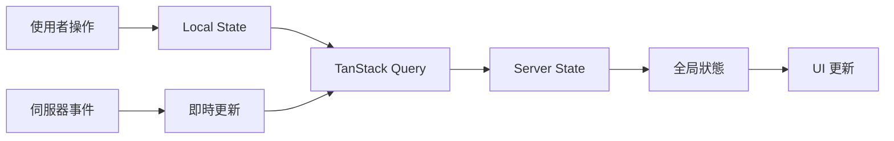
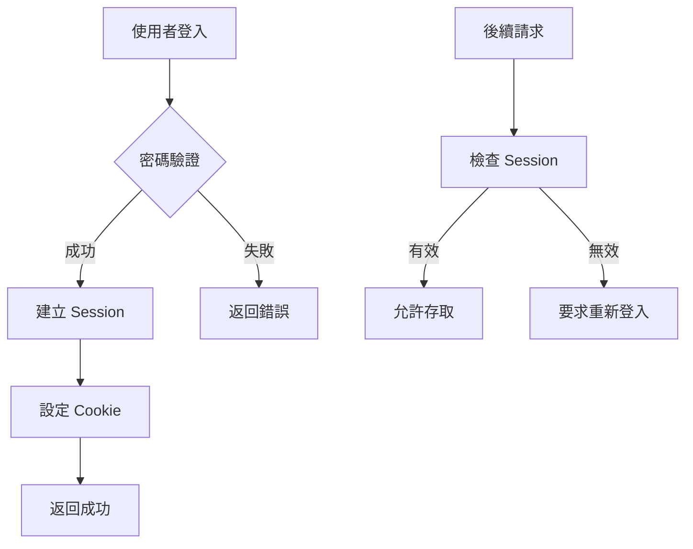

# 系統架構總覽

## 架構圖



## 設計原則

### 1. 關注點分離 (Separation of Concerns)
- **前端**：專注於使用者介面和使用者體驗
- **後端**：處理業務邏輯和資料操作
- **資料庫**：負責資料持久化和查詢

### 2. 安全優先 (Security First)
- PBKDF2 密碼加密
- Session 基礎的身分驗證
- CSRF 保護
- 輸入驗證和消毒

### 3. 漸進式增強 (Progressive Enhancement)
- 基礎功能在所有瀏覽器中運作
- 現代瀏覽器提供增強體驗
- 響應式設計適配所有裝置

### 4. 效能優化 (Performance Optimization)
- 資料快取策略
- 延遲載入 (Lazy Loading)
- 程式碼分割 (Code Splitting)
- 資料庫查詢優化

## 技術決策記錄 (ADR)

### ADR-001: 選擇 React 作為前端框架

**狀態**: 已接受  
**日期**: 2024-01-15

**背景**: 需要選擇現代化前端框架來建構單頁應用程式。

**決策**: 選擇 React 18 with TypeScript

**理由**:
- 大型社群支援和豐富生態系統
- 優秀的開發工具和除錯體驗
- TypeScript 提供類型安全
- 團隊熟悉度高

**後果**:
- 需要學習 React Hooks 和現代 React 模式
- 建置工具設定複雜度增加
- 享有豐富的第三方元件庫

### ADR-002: 使用 Supabase 作為後端服務

**狀態**: 已接受  
**日期**: 2024-01-20

**背景**: 需要可靠的資料庫和後端服務提供商。

**決策**: 使用 Supabase PostgreSQL

**理由**:
- 提供完整的 PostgreSQL 功能
- 內建即時訂閱功能
- 優秀的開發者體驗
- 自動備份和擴展性

**後果**:
- 依賴第三方服務
- 需要處理網路延遲
- 降低基礎設施管理複雜度

### ADR-003: 實施多層級身分驗證

**狀態**: 已接受  
**日期**: 2024-02-01

**背景**: 需要支援不同權限級別的使用者存取。

**決策**: 實施訪客/會員/管理員三級權限系統

**理由**:
- 符合業務需求的資料可見性
- 漸進式權限提升體驗
- 安全性和使用性平衡

**後果**:
- 權限檢查邏輯複雜化
- 需要完善的狀態同步機制
- 提供更好的使用者體驗

## 資料流架構

### 使用者請求流程



### 狀態管理流程



## 安全架構

### 身分驗證流程



### 密碼安全

```typescript
// PBKDF2 密碼雜湊實作
const hashPassword = (password: string, salt: Buffer): PasswordData => {
  return {
    hash: crypto.pbkdf2Sync(password, salt, 100000, 64, 'sha512').toString('hex'),
    salt: salt.toString('hex'),
    iterations: 100000
  };
};
```

## 效能考量

### 前端效能優化

1. **程式碼分割**
```typescript
// 路由層級的程式碼分割
const HistoryOrders = lazy(() => import('./components/HistoryOrders'));
const DashboardStats = lazy(() => import('./components/DashboardStats'));
```

2. **資料快取**
```typescript
// TanStack Query 快取配置
const queryClient = new QueryClient({
  defaultOptions: {
    queries: {
      staleTime: 5 * 60 * 1000, // 5 分鐘
      cacheTime: 10 * 60 * 1000, // 10 分鐘
    },
  },
});
```

### 後端效能優化

1. **資料庫索引**
```sql
-- 訂單查詢索引
CREATE INDEX idx_orders_delivery_date ON orders(delivery_date);
CREATE INDEX idx_orders_status ON orders(status);
CREATE INDEX idx_orders_completed_at ON orders(completed_at);
```

2. **查詢優化**
```typescript
// 分頁查詢避免大量資料載入
const getOrders = async (page: number, limit: number) => {
  return db.select()
    .from(orders)
    .limit(limit)
    .offset((page - 1) * limit);
};
```

## 擴展性設計

### 水平擴展
- 無狀態應用設計
- 資料庫連接池管理
- CDN 靜態資源分發

### 垂直擴展
- 記憶體使用優化
- CPU 密集運算最佳化
- 資料庫查詢效能調整

### 微服務準備
- 清晰的服務邊界定義
- API 版本控制策略
- 服務間通訊協議

## 監控和日誌

### 應用程式監控
```typescript
// 效能監控中間件
const performanceMiddleware = (req: Request, res: Response, next: NextFunction) => {
  const start = Date.now();
  
  res.on('finish', () => {
    const duration = Date.now() - start;
    console.log(`${req.method} ${req.path} - ${duration}ms`);
  });
  
  next();
};
```

### 錯誤追蹤
```typescript
// 全局錯誤處理
app.use((err: Error, req: Request, res: Response, next: NextFunction) => {
  console.error('錯誤詳情:', {
    message: err.message,
    stack: err.stack,
    url: req.url,
    method: req.method,
    timestamp: new Date().toISOString()
  });
  
  res.status(500).json({ 
    error: '內部伺服器錯誤',
    requestId: req.headers['x-request-id']
  });
});
```

## 部署架構

### 生產環境
```yaml
# docker-compose.yml
version: '3.8'
services:
  app:
    build: .
    ports:
      - "5000:5000"
    environment:
      - NODE_ENV=production
      - DATABASE_URL=${DATABASE_URL}
    restart: unless-stopped
    
  nginx:
    image: nginx:alpine
    ports:
      - "80:80"
      - "443:443"
    volumes:
      - ./nginx.conf:/etc/nginx/nginx.conf
    depends_on:
      - app
```

### CI/CD 流程
```yaml
# .github/workflows/deploy.yml
name: Deploy to Production
on:
  push:
    branches: [main]
jobs:
  deploy:
    runs-on: ubuntu-latest
    steps:
      - uses: actions/checkout@v2
      - name: Setup Node.js
        uses: actions/setup-node@v2
        with:
          node-version: '18'
      - name: Install dependencies
        run: npm ci
      - name: Run tests
        run: npm test
      - name: Build application
        run: npm run build
      - name: Deploy to production
        run: ./scripts/deploy.sh
```

## 災難恢復

### 備份策略
- **資料庫**: 每日自動備份，保留 30 天
- **程式碼**: Git 版本控制，多個遠端儲存庫
- **設定檔**: 加密儲存在安全位置

### 恢復程序
1. 評估故障範圍和影響
2. 切換到備用環境
3. 從最新備份恢復資料
4. 驗證系統功能
5. 更新 DNS 指向新環境

---

**文件版本**: 1.0.0  
**最後更新**: 2024年5月30日  
**審查者**: 系統架構師  
**下次審查**: 2024年8月30日